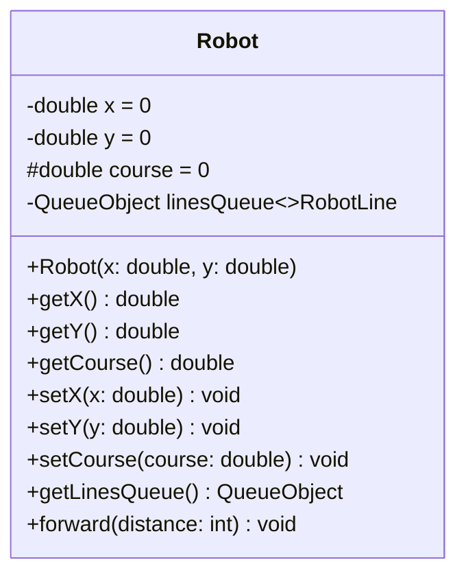
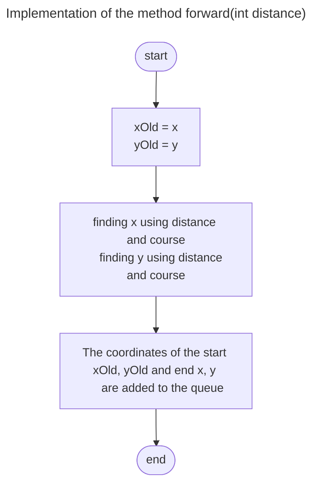
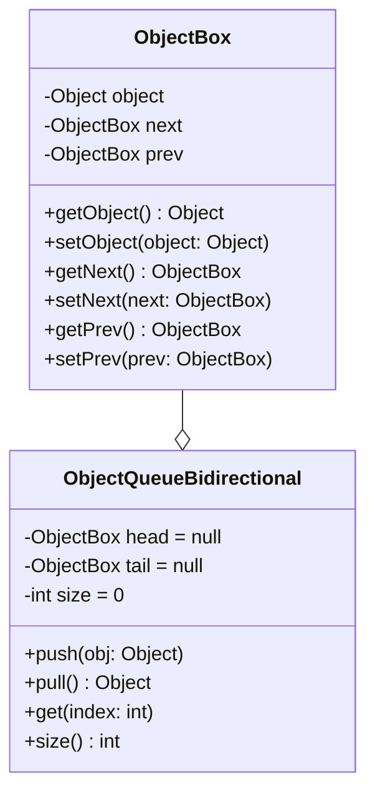
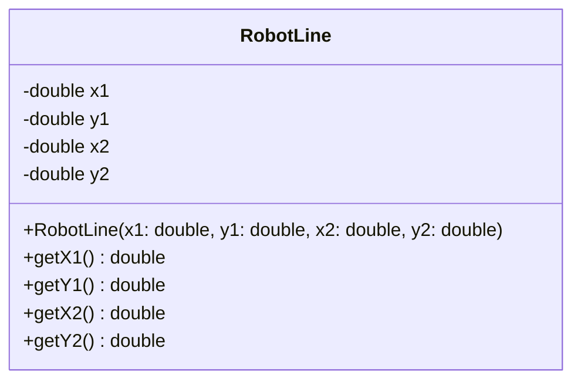
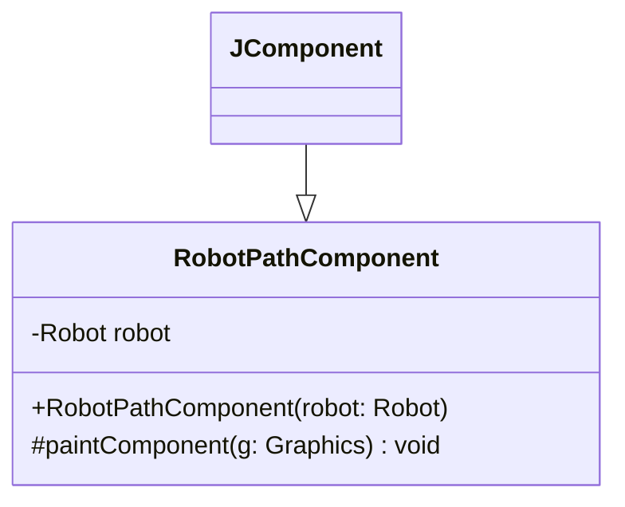

# Queue.
## Implement the queue data structure.
1. First In First Out. A unidirectional linked list with 
a tail pointer.
2. First In First Out. 
A unidirectional linked list without a tail pointer.
3. Implement a bidirectional list - you can move not only 
from head to tail, but also from tail to head. 
This will speed up the execution of the get function.
4. Implement stack - LIFO - Last In First Out.
5. Implement Robot Visualization section using our queue.

## Robot visualization.

### Robot properties.
1. Walking forward.
2. Turns.
* The robot will remember the entire path that it has 
passed - that is, it will keep a queue of straight lines 
that it has passed.

* To store the coordinates of one segment of the path, 
we implement the RobotLine class. This is a simple class 
that includes 4 numbers - the coordinates of the starting point (X1, Y1) 
and the coordinates of the ending point (X2, Y2).

* We implement the RobotPathComponent class, 
which inherits from the JComponent class. A Robot with its own list of path 
segments is passed to this class.

* In the paintComponent method, by iterating through all the segments, 
we get the coordinates of each and draw a line by calling the drawLine 
method of the Graphics class.
* Implement the RobotFrame class to display the form.
* Implement the RobotManager class to run the entire application.
